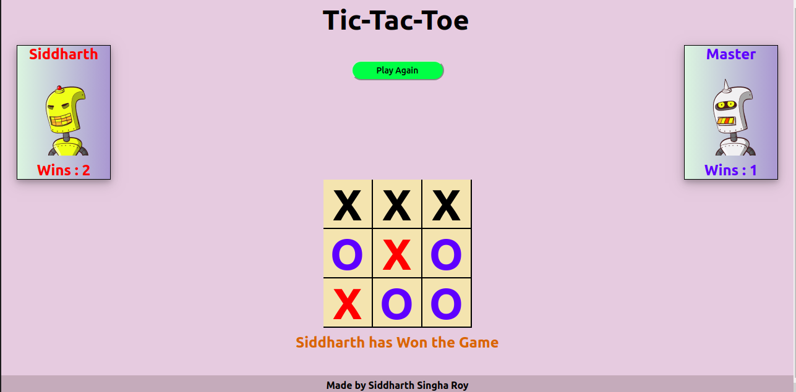

# Tic-Tac-Toe
A simple Tic-Tac-Toe game made using ReactJS and Redux library.



Clone this repository in a folder and change your directory to that folder

To run this on your local machine we need **NodeJS, npm package, ReactJS, Redux Library**

**For installing NodeJS run the following commands**

```
sudo apt update
sudo apt install nodejs
```

**Now we need to install npm and then initialise it in a folder**

```
sudo apt install npm
npm init
```
If your machine has administrator priviledges then we do not need to use sudo for the following commands

**To install Reactjs globally**

```
sudo npm install -g react
sudo npm install -g create-react-app
```

**To install Redux Library**

```
sudo npm install redux
sudo npm install react-redux
```
And done!!!!

To run this on your local machine use

`npm start`
